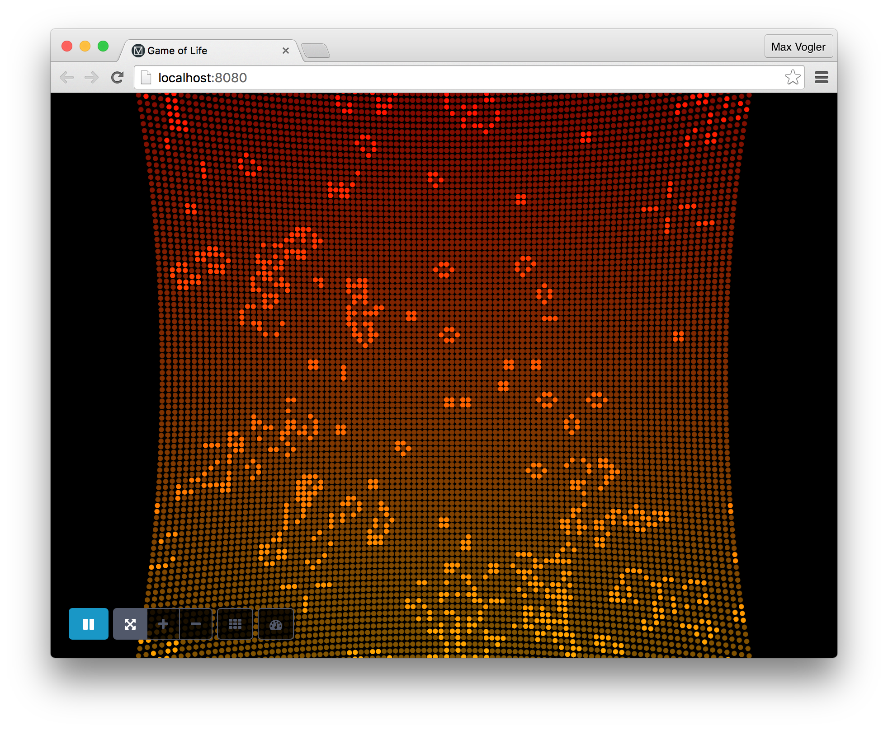

# Conway's Game of Life


An experimental, multiplayer, client-server implementation of Conway's Game of Life.

### Server
The Java backend calculates the Game of Life cells using all available CPU cores, storing the state in a combination of immutable and mutable fixed-length bit strings.

### Client
The HTML5 frontend receives the current state using WebSockets and displays a 3D user interface using WebGL. The same WebSockets are used to transfer commands to the Server.


## Build or [Download](https://github.com/mr-max/conways-game-of-life/releases/download/v1.0/life-1.0.jar)
```
bower install
./gradlew jar
cd build/libs/
```

## Run
```
java -jar life-1.0.jar
```
This starts the game with a 100x100 grid. Access it on `http://localhost:8080`

To start the Game with a custom Grid size (e.g. 200x200) call:
```
java -jar life-1.0.jar 200
```
